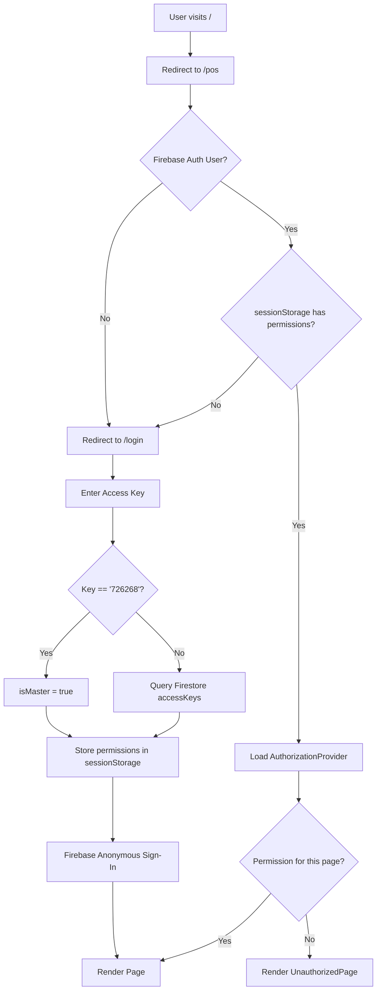

# 🏪 UrbanPOS — Full Project Analysis

## 1. Project Overview

**UrbanPOS** is a cloud-backed, installable **Point of Sale (POS) web application** built for small to medium-sized businesses. It runs on **Next.js 15** with the App Router and connects to **Firebase (Firestore + Auth)** as its real-time backend.

| Property | Value |
|---|---|
| **Framework** | Next.js 15 (App Router, Turbopack) |
| **Backend** | Firebase Firestore + Firebase Auth (Anonymous) |
| **Styling** | Tailwind CSS v3 + ShadCN UI |
| **AI** | Google Genkit (`@genkit-ai/google-genai`) |
| **Email** | Nodemailer (SMTP/Gmail) |
| **Currency** | Open Exchange Rates API |
| **PWA** | `@ducanh2912/next-pwa` |
| **Forms** | React Hook Form + Zod |
| **Charts** | Recharts |

---

## 2. Architecture

```
src/
├── app/
│   ├── (dashboard)/          # Route group — all authenticated pages
│   │   ├── layout.tsx        # Auth guard + sidebar layout
│   │   ├── pos/              # Point of Sale screen
│   │   ├── dashboard/        # Analytics/metrics
│   │   ├── inventory/        # Product + category CRUD
│   │   ├── sales/            # Sales history
│   │   ├── coupons/          # Coupon management
│   │   ├── settings/         # Store settings + access key mgmt
│   │   └── unauthorized/     # Permission denied page
│   ├── login/                # Access key login
│   ├── actions.ts            # Server Actions (email, exchange rates)
│   └── layout.tsx            # Root layout (PWA + fonts)
├── firebase/
│   ├── config.ts             # Firebase config (from env vars)
│   ├── index.ts              # SDK initializer
│   ├── provider.tsx          # React context for Firebase
│   ├── firestore/            # Real-time hooks (useCollection, useDoc)
│   └── ...                   # Non-blocking update utilities
├── hooks/
│   └── use-authorization.tsx # Client-side permission context
├── components/
│   ├── ui/                   # 36 ShadCN UI components
│   ├── receipt.tsx           # HTML receipt generator
│   └── dashboard-nav.tsx     # Sidebar navigation
├── lib/
│   └── data.ts               # TypeScript type definitions
└── ai/
    └── dev.ts                # Genkit AI entrypoint (minimal)
```

### Auth & Access Flow



---

## 3. ✨ Best Features

### 3.1 Progressive Web App (PWA)
The app is fully installable on desktop and mobile via `@ducanh2912/next-pwa`. It provides offline-capable asset caching and a native-like experience. This is a strong differentiator for a POS solution used on fixed hardware (e.g., a tablet at a register).

### 3.2 Multi-Level Permission Key System
A flexible role-based access system:
- **Super Master Key** — hardcoded, gives full access
- **Master Keys** (stored in Firestore) — full access keys created by admin
- **Permission Keys** — keys that only unlock specific pages (e.g., `pos` only for cashiers, `dashboard` for managers)

This is well-designed for multi-staff deployments.

### 3.3 Real-Time Firebase Hooks
The `useCollection` and `useDoc` hooks in `src/firebase/firestore/` use Firestore's `onSnapshot` for live data — products, sales, coupons, and settings all update in real-time across devices.

### 3.4 Non-Blocking UI Updates
The `setDocumentNonBlocking` utility in `non-blocking-updates.tsx` writes to Firestore without awaiting, keeping the UI snappy. This is a solid UX pattern for POS environments where speed is critical.

### 3.5 Professional Email Receipts (Server Action)
The `sendEmailReceipt` Server Action in `actions.ts` parses raw HTML receipt content, rebuilds it as a professional, inline-styled HTML email, and sends it via Nodemailer. This is a well-structured server-side feature.

### 3.6 Exchange Rate Integration
The `syncExchangeRates` Server Action calls the Open Exchange Rates API and batch-writes all currency conversion rates to Firestore in a single atomic write — an efficient and production-ready implementation.

### 3.7 Strong TypeScript Foundation
All domain entities (`Product`, `Sale`, `Coupon`, `AccessKey`, `Settings`, etc.) are fully typed in `src/lib/data.ts`. Form schemas are validated with Zod, providing end-to-end type safety from forms to Firestore.

### 3.8 Modern UI Component Library
Uses ShadCN UI (36 components) which are headless, accessible (WCAG), and highly customizable. Combined with Tailwind CSS, this produces a professional, consistent UI.

### 3.9 Responsive + Mobile-First Design
Desktop sidebar collapses to an icon mode; on mobile a Sheet drawer is used. The layout gracefully handles both screen sizes — essential for a POS app that may run on tablets.

### 3.10 Genkit AI Integration (Groundwork Laid)
The Genkit AI SDK is installed and configured (`@genkit-ai/google-genai`). While currently minimal (`src/ai/dev.ts` is essentially empty), the groundwork is laid for AI-powered features like product suggestions, sales summaries, or inventory forecasting.

---

## 4. 🐛 Faults & Bugs

### 4.1 Hardcoded Master Key in Source Code
**File:** [`src/app/login/page.tsx` L30](file:///d:/test%20site/Urban-POs/src/app/login/page.tsx)
```ts
const masterKey = "726268";
```
The super master key is hardcoded directly in the client-side login component. **This JavaScript is shipped to the browser.** Anyone opening DevTools can see the master key. It's also mentioned in the README.

**Fix:** Move master key comparison to a Server Action and store it in an environment variable (`MASTER_ACCESS_KEY`).

---

### 4.2 Premature `setIsProcessing(false)` on Master Key Login
**File:** [`src/app/login/page.tsx` L60-63](file:///d:/test%20site/Urban-POs/src/app/login/page.tsx)
```ts
if (accessKey === masterKey) {
  handleSuccessfulLogin({ isMasterKey: true, tagName: 'Master Key' });
  return;  // <-- setIsProcessing(false) is NEVER called for master key path
}
```
When the master key is entered, `handleSuccessfulLogin` is called but `setIsProcessing(false)` is never called if the login fails mid-way (e.g., on anonymous sign-in failure). This leaves the button in a perpetual "Verifying..." disabled state.

**Fix:** Wrap with try/finally to always reset `isProcessing`.

---

### 4.3 `isAuthorized` Computed with Stale `hasPermission` Reference
**File:** [`src/hooks/use-authorization.tsx` L67-88](file:///d:/test%20site/Urban-POs/src/hooks/use-authorization.tsx)
```ts
const isAuthorized = useMemo(() => {
  ...
  return hasPermission(requiredPermission); // hasPermission not in dep array!
}, [pathname, permissions, isClient]);
```
`hasPermission` is defined as a regular function inside the component but not included in the `useMemo` dependency array. If `hasPermission`'s behavior depends on `permissions`, stale closure bugs can occur.

**Fix:** Add `hasPermission` to the dependency array or inline the logic.

---

### 4.4 `.gitignore` Has a Merged Line Bug
**File:** [`.gitignore` L45](file:///d:/test%20site/Urban-POs/.gitignore)
```
firestore-debug.log.env.local   ← TWO entries accidentally merged into one
```
This means `firestore-debug.log` is **not actually gitignored**, and neither is `.env.local` (as a standalone pattern). Line 41 uses `.env*` which catches `.env` and `.env.local`, but `firestore-debug.log` may leak.

---

### 4.5 Missing Stock Validation on Sale
There's no indication in the `actions.ts` or POS data flow of stock quantity being validated before a sale is completed. If two cashiers sell the last unit simultaneously, the stock could go negative without an error.

**Fix:** Use a Firestore batched transaction with stock check before decrementing `stockQuantity`.

---

### 4.6 No Rate Limiting / Brute Force Protection on Login
The login handler queries Firestore on every key attempt with no throttle, lockout, or CAPTCHA. An attacker can rapidly attempt keys.

**Fix:** Implement a server-side attempt counter per session stored in a secure HTTP-only cookie, or move authentication to a Server Action with rate limiting.

---

### 4.7 Coupon Validation Is Likely Client-Side Only
The coupon system (`/coupons`) manages `usageCount` and `isActive`. However, with open Firestore rules (see below), a client could manipulate `usageCount` or reuse coupons without server validation.

**Fix:** Validate and increment coupon usage inside a Server Action / Cloud Function.

---

## 5. 🔒 Security Concerns

> [!CAUTION]
> Several of these issues are **critical** and should be addressed before any production deployment.

### 🔴 CRITICAL: Firestore Rules — Public Read/Write
**File:** [firestore.rules](file:///d:/test%20site/Urban-POs/firestore.rules)
```js
allow read, write: if true;
```
**Every single Firestore document is publicly readable and writable by anyone on the internet** — without authentication. This means:
- Anyone can read all sales, customer data, and product prices.
- Anyone can create fake sales, delete products, or alter settings.
- The `accessKeys` collection can be read to enumerate all valid keys.

**This is the single most critical security issue in the entire project.**

**Fix:**
```js
rules_version = '2';
service cloud.firestore {
  match /databases/{database}/documents {
    match /{document=**} {
      allow read, write: if request.auth != null;
    }
    // Tighten further per-collection as needed
    match /accessKeys/{keyId} {
      allow read: if false; // Never expose keys to clients directly
    }
  }
}
```

---

### 🔴 CRITICAL: Live API Credentials in `.env` (Not `.env.local`)
**File:** [.env](file:///d:/test%20site/Urban-POs/.env)

The `.env` file contains **live production credentials**:
- `GEMINI_API_KEY` (Google AI — billing risk)
- `NEXT_PUBLIC_FIREBASE_*` (Firebase project — data exposure)
- `SMTP_PASSWORD` (Gmail App Password — email account risk)
- `OPEN_EXCHANGE_RATES_APP_ID` (API billing risk)

While `.gitignore` has `.env*` which *should* catch this, the file exists as `.env` (not `.env.local`). The `NEXT_PUBLIC_` prefixed variables are intentionally sent to the browser bundle by Next.js — so Firebase config **is already public by design**, which is acceptable for Firebase. However, the SMTP credentials and Gemini key are **server-side only** and must never be in `.env` files committed to version control.

**Fix:**
1. Rename to `.env.local` (never committed).
2. For deployed environments, use the hosting platform's secret manager (Firebase App Hosting secrets, Vercel environment variables, etc.).
3. Rotate all exposed credentials immediately.

---

### 🔴 CRITICAL: Hardcoded Master Key Exposed in Client Bundle
As noted in §4.1, the master key `726268` is in a `'use client'` component. It is compiled into the browser JavaScript bundle and is trivially discoverable.

---

### 🟠 HIGH: Client-Side-Only Authorization (sessionStorage)
All page permissions are stored in `sessionStorage` as plain JSON. Any logged-in user can open DevTools and run:
```js
sessionStorage.setItem('userPermissions', JSON.stringify({ isMaster: true, pages: [] }))
```
...and immediately gain master access to all pages in the current tab. The Firebase Anonymous Auth user has no associated server-side role — the permissions exist only in the client.

**Fix:** After anonymous sign-in, store the role/permissions server-side (e.g., Firebase Custom Claims set by a Cloud Function after key validation). Then verify claims in Firestore Rules.

---

### 🟠 HIGH: Email HTML Does Not Sanitize Input
**File:** [`src/app/actions.ts` L16](file:///d:/test%20site/Urban-POs/src/app/actions.ts)
```ts
const dom = new JSDOM(receiptContent);
```
The `receiptHtml` passed to `createProfessionalEmailHtml` comes from the client. While it's a Server Action (so it runs server-side), if the input HTML contains scripts or malicious content, JSDOM parses it and `.textContent` extracts text — which is relatively safe. However, `getHtml()` is defined but retrieves `.innerHTML` which is never used in a safe context in this code path. The risk is low currently but the pattern is fragile.

**Fix:** Validate and sanitize the input HTML using a library like `DOMPurify` (via JSDOM) before parsing.

---

### 🟡 MEDIUM: No Input Rate Limiting on Server Actions
The `sendEmailReceipt` and `syncExchangeRates` Server Actions have no rate limiting. A malicious actor who discovers the endpoint could:
- Flood your SMTP server with emails (cost/billing).
- Exhaust your Open Exchange Rates API quota.

**Fix:** Add a server-side rate limiter (e.g., using Redis or a simple in-memory counter with exponential backoff) in the Server Actions.

---

### 🟡 MEDIUM: `jsdom` in Production Dependencies
`jsdom` is listed as a **production dependency** (not `devDependencies`). It's a large Node.js DOM emulation library used only for email HTML parsing in one Server Action. This significantly bloats the production bundle.

**Fix:** It belongs in production deps since it runs in a Server Action, but consider replacing this pattern with a lightweight HTML parser instead.

---

### 🟡 MEDIUM: `apphosting.yaml` Exposes Runtime Config
**File:** [apphosting.yaml](file:///d:/test%20site/Urban-POs/apphosting.yaml)
Review this file to ensure no secrets or sensitive config values are embedded directly.

---

## 6. Code Quality Assessment

| Area | Rating | Notes |
|---|---|---|
| **TypeScript Coverage** | ⭐⭐⭐⭐⭐ | Fully typed, Zod validation |
| **Component Architecture** | ⭐⭐⭐⭐ | Clean separation, ShadCN base |
| **Firebase Usage** | ⭐⭐⭐⭐ | Real-time hooks, non-blocking writes |
| **Error Handling** | ⭐⭐⭐ | Present on Server Actions, sparse on client hooks |
| **Security** | ⭐ | Critical issues in auth, rules, and secrets |
| **Testing** | ⭐ | No test files found |
| **Documentation** | ⭐⭐⭐⭐ | Good README, typed data models |
| **Performance** | ⭐⭐⭐⭐ | Turbopack, non-blocking UI, PWA caching |

---

## 7. Summary of Issues by Priority

| # | Severity | Issue |
|---|---|---|
| 1 | 🔴 Critical | Firestore rules allow public read/write |
| 2 | 🔴 Critical | Master key `726268` hardcoded in client JS |
| 3 | 🔴 Critical | Live API keys / SMTP password in `.env` file |
| 4 | 🟠 High | Authorization is purely client-side (sessionStorage bypass) |
| 5 | 🟠 High | Unsafe HTML input in email Server Action |
| 6 | 🟡 Medium | No rate limiting on login or Server Actions |
| 7 | 🟡 Medium | No brute-force protection on key login |
| 8 | 🟡 Medium | No stock validation / race condition on sale |
| 9 | 🟡 Medium | Coupon usage not validated server-side |
| 10 | 🟡 Medium | `.gitignore` line 45 merges two entries (bug) |
| 11 | 🟢 Low | `setIsProcessing` never reset on master key error path |
| 12 | 🟢 Low | `hasPermission` missing from `useMemo` dependency array |
| 13 | 🟢 Low | Genkit AI dependency installed but not implemented |

---

## 8. Recommendations

1. **Immediately** rotate all API keys and credentials in `.env` — treat them as compromised.
2. **Immediately** fix Firestore security rules to require authentication.
3. **Move** master key logic to a Server Action + environment variable.
4. **Implement** Firebase Custom Claims to store roles server-side.
5. **Add automated tests** — at minimum, unit test auth and permission logic.
6. **Add rate limiting** to the login flow and all Server Actions.
7. **Implement stock race condition protection** using Firestore transactions.
